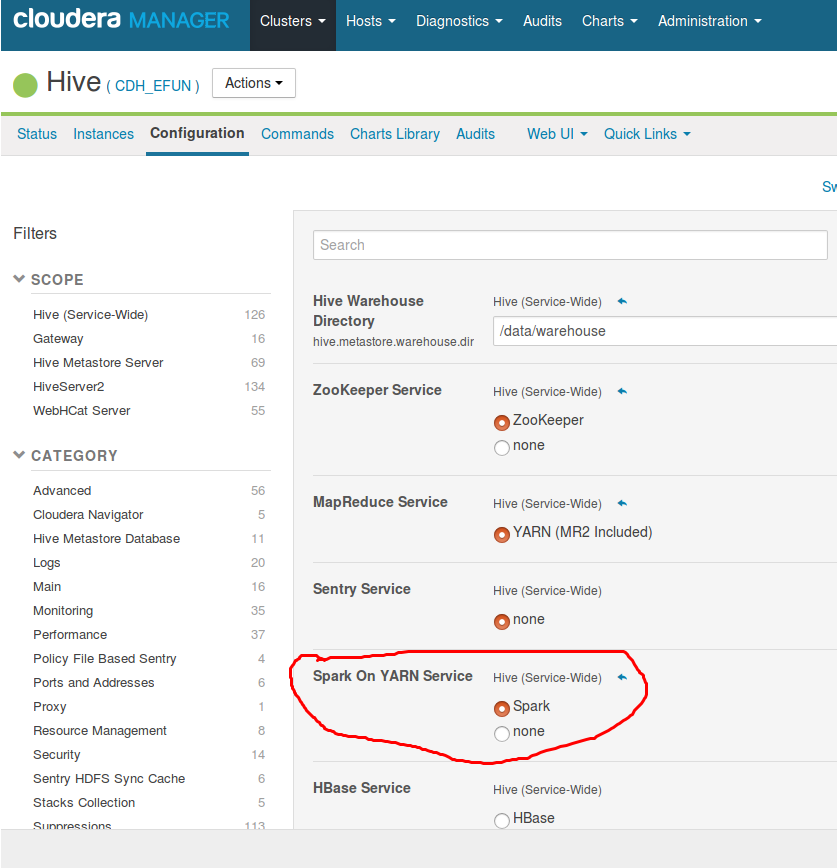

# 7.配置CDH集群服务

我们需要通过*CDH管理控制台*顺序的安装的以下服务
* zookeeper
* hdfs
* yarn
* hive
* hbase
* impala
* spark

## 7.1 增加和配置zookeeper

| 配置项   | 值 |
| ------------ | ------------- |
| server 	| ehdp-s1,ehdp-s2,ehdp-s3 |

## 7.2 增加和配置HDFS

| 配置项   | 值 | 说明 |
| ------------ | ------------- | ------------- |
| NameNode 	| ehdp-m | 主节点  |
| SecondaryNameNode 	|ehdp-cm | 备份主节点 |
| DataNode  | ehdp-s1,ehdp-s2,ehdp-s3| 数据节点 |

## 7.3 增加和配置YARN
| 配置项	| 值 	| 说明  |
| ------------ | ------------- | ------------- |
| ResourceManager 	| ehdp-m |  资源节点 |
| NodeManager 	| ehdp-s1,ehdp-s2,ehdp-s3 | 管理节点 |

## 7.4 增加和配置HIVE

### 7.4.1metastore配置
`Hive Metastore Database Type` 选择 `postgresql`

`Hive Metastore Database Name` 填写 `hive`

`Hive Metastore Database Host` 填写 `ehdp-cm`

`Hive Metastore Database Port` 填写 `5432`

`Hive Metastore Database User` 填写 `hive`

`Hive Metastore Database Password` 填写 `xxxx`

点击测试通过即可

### 7.4.2主机分配配置项
| 配置项	| 值 	| 说明  |
| ------------ | ------------- |  ------------- |
| Hive Metastore Server 	| ehdp-cm  | 元数据server，需要读取数据库 |
| WebHCat Server 	| ehdp-m  | 监控server |
| HiveServer2 | ehdp-s1,ehdp-s2,ehdp-s3 | hive执行客户端 |

## 7.5 增加和配置HBASE

| 配置项	| 值 	|  说明  |
| ------------ | ------------- | ------------- |
| Master 	| ehdp-m | 主控节点    |
| RegionServer | ehdp-s1,ehdp-s2,ehdp-s3 | 运行节点

### 7.5.1 内存配置
`Java Heap Size of HBase Master in Bytes` 至少`1G`以上

`Java Heap Size of HBase RegionServer in Bytes` 至少`4G`以上

## 7.6 增加和配置IMPALA并配置
Impalaserver是一个分布式的，大规模并行处理（MPP）的数据库引擎

### 7.6.1 impala主机分布

| 配置项	| 值 	| 说明  |
| ------------ | ------------- | ------------- |
| Impala Catalog Service 	| ehdp-m | 传递Metadata的变化 |
| impala Statestore 	| ehdp-m | 监控主机的状况，通常与Catalog Service部署在同一台主机上 |
| Impala Daemon	| ehdp-s1,ehdp-s2,ehdp-s3 | impalad守护进程，必须分布在datanode上 |

### 7.6.2内存配置
由于impala执行的过程中相当耗费内存，尤其是join的过程中，所有建议修改他们的配置。

`Impala Daemon Memory Limit` 项配置为`4G`以上

`Java Heap Size of Impala Llama ApplicationMaster in Bytes` 项配置为`4G`以上

## 7.7 增加和配置SPARK

| 配置项	| 值 	| 说明  |
| ------------ | ------------- | ------------- |
| History Server 	| ehdp-m | 应用运行状况UI查看服务 |
| Gateway 	| edhp-1,edhp-2,edhp-3 | spark客户端配置 |

## 7.8 配置HIVE使用SPARK
### 7.8.1 HIVE打开SPARK
在`hive`服务的`Configuration`中找到 `Spark On YARN Service` 项，

选中 Spark。

### 7.8.2HIVE默认使用SPARK
在`hive`的`Configuration`中找到 `Default Execution Engine`项，

选中 Spark。

