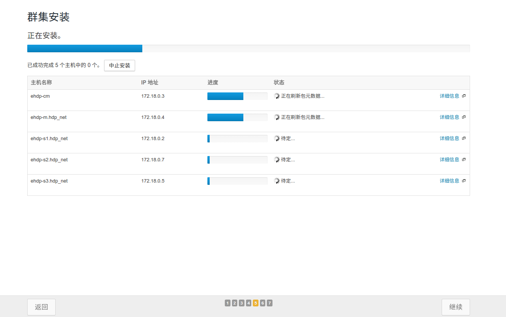
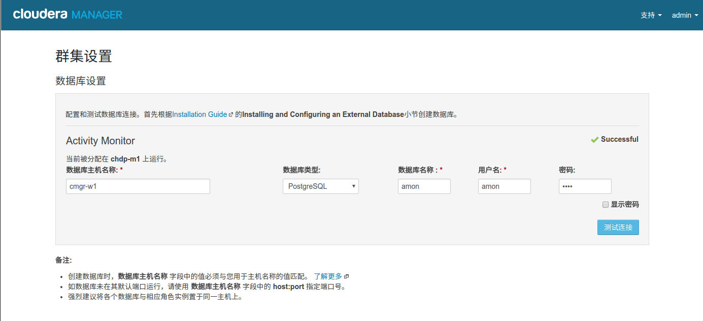

# 6.安装HDP集群
以下内容均在浏览器中进行，优先下载ssh.tar,并自行解压以备后续使用。

	地址：
	http://chdp-ambari:8080

	http://chdp-ambari/install/ssh.tar

## 6.1 同意安装协议

勾选`是`，并`继续`

## 6.2 选择CDH版本为EXPRESS

选择`express`版本即可，并`继续`，然后会出现该版本的所有服务，点击`继续`即可

## 6.3 搜索服务器
填写服务器名称`列表`，并修正`ssh端口号`，点击`搜索`,当找到服务器后，点击`继续`

## 6.4 修改parcel配置
转入到`选择存储库`页面后，在选择`使用parcel`后，点击`更多选项`,
填写`远程配置库的URL` 后点击`保存配置`
	cdh5  http://ehdp-cm/cdh5/parcels/5/
	kafka http://ehdp-cm/kafka/parcels/latest/

如果填写正确，稍等片刻后，就会出现正确的parcel版本，下来就可以自定义`agent库`
填写正确的`url`后，点击`继续`。

	baseurl http://ehdp-cm/cm5/5/
	gpgkey  http://ehdp-cm/cm5/RPM-GPG-KEY-cloudera

## 6.5 同意agent服务器jdk和集群模式
界面会跳转至jdk安装，取消安装jdk，点击`继续`，取消单用户模式，点击`继续`。

## 6.6 配置ssh登录选项
在身份认证方法中点击`所有主机接受相同私钥`，选择已经下载的私钥文件`id_rsa`,并`继续`

## 6.8 等待安装完成
以下过程需要大量的网络资源，需要有内心的等待以下：

该过程属于自动安装，确认上面的配置没有问题后，系统会在对应的主机上开始安装`agent`
，安装完毕后，点击`继续`就会开始安装`parcel`，按照步骤逐步分发完成后点击`继续`，最后会通过检查主机的配置方案，点击`完成`。整个安装就成功了。

## 6.8 集群设置
上面的过程完毕后，就会出现一个集群设置窗口，选择`自定义服务`，选择`zookeeper`,点击`继续`，选择需要配置clouder-server的监控服务，大致按照下面的列表选择即可，点击`继续`,并等待`完成`。

| 配置项   | 值 | 说明 |
| ------------ | ------------- | ------------- |
| Alert Publisher 	| ehdp-cm |  通知服务器 |
| Event Server 	|ehdp-cm |  事件服务器 |
| Host Monitor  | ehdp-cm |  主机监控节点 |
| Service Monitor  | ehdp-cm | 服务监控节点 |

